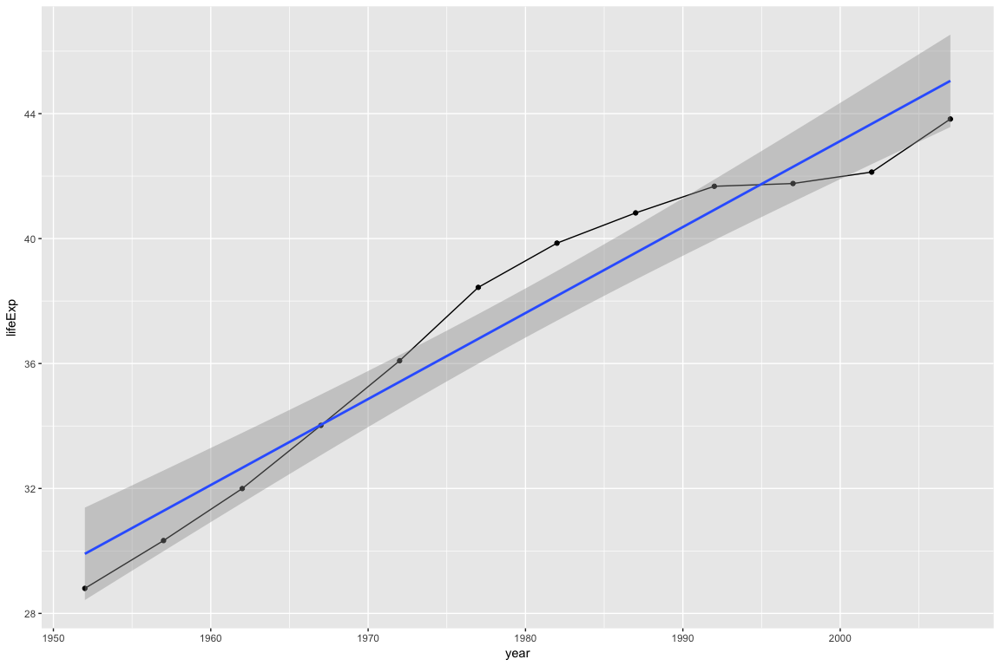
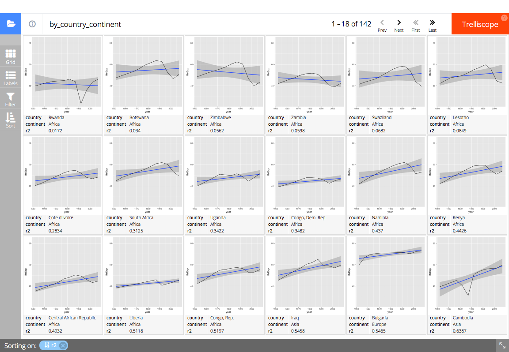

<!-- README.md is generated from README.Rmd. Please edit that file -->
auto\_cogs
==========

[](https://travis-ci.org/schloerke/autocogs) [](https://codecov.io/github/schloerke/autocogs?branch=master) [](https://cran.r-project.org/package=autocogs)

Automatically add cognostics for each plot in a given panel column. Cognostics are univariate statistics for a subset of data. Autocogs are particularly useful for list-column `data_frame`s being fed into `trelliscopejs::trelliscope`.

Installation
------------

You can install autocogs from github with:

``` r
# install.packages("devtools")
devtools::install_github("schloerke/autocogs")
```

Examples
--------

### Gapminder

This is a basic example which shows you how to solve a common problem:

``` r
library(gapminder)
#> [1] TRUE
library(tidyverse)
#> [1] TRUE
library(autocogs)
#> [1] TRUE

# Set up data
## nest the data according to the country and continent
gapminder %>%
  group_by(country, continent) %>%
  nest() %>%
  mutate(
    # create a column of plots with a
    # * line
    # * points
    # * and a linear model
    panel = lapply(data, function(dt) {
      ggplot(dt, aes(year, lifeExp)) +
        geom_line() +
        geom_point() +
        geom_smooth(method = "lm")
    })
  ) %>%
  print() ->
gap_data
#> # A tibble: 142 x 4
#>        country continent              data    panel
#>         <fctr>    <fctr>            <list>   <list>
#>  1 Afghanistan      Asia <tibble [12 x 4]> <S3: gg>
#>  2     Albania    Europe <tibble [12 x 4]> <S3: gg>
#>  3     Algeria    Africa <tibble [12 x 4]> <S3: gg>
#>  4      Angola    Africa <tibble [12 x 4]> <S3: gg>
#>  5   Argentina  Americas <tibble [12 x 4]> <S3: gg>
#>  6   Australia   Oceania <tibble [12 x 4]> <S3: gg>
#>  7     Austria    Europe <tibble [12 x 4]> <S3: gg>
#>  8     Bahrain      Asia <tibble [12 x 4]> <S3: gg>
#>  9  Bangladesh      Asia <tibble [12 x 4]> <S3: gg>
#> 10     Belgium    Europe <tibble [12 x 4]> <S3: gg>
#> # ... with 132 more rows

# Look at the first panel (ggplot2 plot)
gap_data$panel[[1]]
```



``` r

# Add cognostic information given the panel column plots
full_gap_data <- gap_data %>% add_panel_cogs() %>% print()
#> # A tibble: 142 x 11
#>        country continent              data    panel    `_scagnostic`
#>         <fctr>    <fctr>            <list>   <list>           <list>
#>  1 Afghanistan      Asia <tibble [12 x 4]> <S3: gg> <tibble [1 x 9]>
#>  2     Albania    Europe <tibble [12 x 4]> <S3: gg> <tibble [1 x 9]>
#>  3     Algeria    Africa <tibble [12 x 4]> <S3: gg> <tibble [1 x 9]>
#>  4      Angola    Africa <tibble [12 x 4]> <S3: gg> <tibble [1 x 9]>
#>  5   Argentina  Americas <tibble [12 x 4]> <S3: gg> <tibble [1 x 9]>
#>  6   Australia   Oceania <tibble [12 x 4]> <S3: gg> <tibble [1 x 9]>
#>  7     Austria    Europe <tibble [12 x 4]> <S3: gg> <tibble [1 x 9]>
#>  8     Bahrain      Asia <tibble [12 x 4]> <S3: gg> <tibble [1 x 9]>
#>  9  Bangladesh      Asia <tibble [12 x 4]> <S3: gg> <tibble [1 x 9]>
#> 10     Belgium    Europe <tibble [12 x 4]> <S3: gg> <tibble [1 x 9]>
#> # ... with 132 more rows, and 6 more variables: `_x` <list>, `_y` <list>,
#> #   `_bivar` <list>, `_smooth` <list>, `_lm` <list>, `_n` <list>

# display the panel and cognostics in a trelliscopejs widget
## sort all panels by worst to best R^2 (percent explained by linear model)
trelliscopejs::trelliscope(
  full_gap_data, "gapminder life expectancy",
  panel_col = "panel",
  self_contained = TRUE,
  ncol = 8, nrow = 4,
  auto_cog = FALSE,
  state = list(
    sort = list(list(name = "r2", dir = "asc")),
    labels = c("country", "continent", "r2")
  )
)
```



``` r
# (screen shot of trelliscopejs widget)
```
